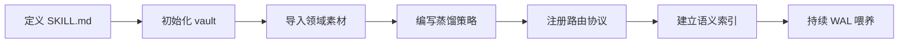

# KK Nexus — 多员工知识系统框架

> 构建你自己的"AI 员工团队"——每个员工是一个专业化的 agent，配备独立知识库（vault），
> 通过语义搜索统一索引，实现持续学习与自我进化。

KK Nexus 是一个基于 [Codex](https://github.com/openai/codex-cli) 的开源框架，为你提供构建**多员工-多知识库 AI 知识操作系统**的完整设计蓝图和工具链。

---

## 设计哲学

```
Don't tell it what to do. Give it success criteria and watch it go.
                                                    — Andrej Karpathy
```

| 理念 | 落地 |
|------|------|
| **员工 = Skill** | 每个员工是一个独立的 Codex skill，拥有专属领域和 vault |
| **知识 = Vault** | 结构化知识库体系：raw → knowledge → cases → templates |
| **索引 = txtai** | 跨 vault 统一语义搜索，离线、轻量、私有 |
| **进化 = WAL** | Write-Ahead Logging 协议，每次会话的决策和教训被持久化 |
| **自治 = Health Check** | 每周自动健康检查 + 自修复机制 |

---

## 核心架构

```
┌─────────────────────────────────────────────────────────┐
│                    第4层 · 集成层                       │
│       MCP / Obsidian / Ontology / txtai 语义搜索        │
├─────────────────────────────────────────────────────────┤
│                    第3层 · 员工层                       │
│    独立的 skill 化员工，各配专属 vault                  │
│    ┌────────┐ ┌────────┐ ┌────────┐     ┌────────┐    │
│    │ 员工01 │ │ 员工02 │ │ 员工03 │ ... │ 员工N  │    │
│    └────────┘ └────────┘ └────────┘     └────────┘    │
├─────────────────────────────────────────────────────────┤
│                    第2层 · 知识库                       │
│  raw/ → 蒸馏 → knowledge/ → 索引 → cases/ + templates/ │
│      Zettelkasten 节点 · YAML 元数据 · 来源引用协议     │
├─────────────────────────────────────────────────────────┤
│                    第1层 · 工具链                       │
│    Python 脚本：摄取 / 蒸馏 / 索引 / 健康检查 / WAL    │
└─────────────────────────────────────────────────────────┘
```

---

## 快速开始

### 前置要求

- Python >= 3.10
- Git
- 磁盘 >= 3GB · 内存 >= 8GB

### 安装

```powershell
git clone https://github.com/ConnorKK-claw/kk-nexus.git
cd kk-nexus
pip install txtai sentence-transformers
```

### 创建你的第一个员工

```powershell
# 1. 初始化 vault 骨架
python scripts/bootstrap_vault.py --vault ~/my-skill/vault --domain my-domain

# 2. 编写 SKILL.md（定义员工能力与领域知识）

# 3. 导入知识素材
python scripts/vault_ingest.py --input my-knowledge.md --vault ~/my-skill/vault --source user

# 4. 建立语义索引
python scripts/txtai_index.py --full

# 5. 建立知识索引
python scripts/build_index.py ~/my-skill/vault

# 6. 注册员工路由（详见 KK-NEXUS-SKILL.md 中的路由协议）
```

---

## 项目结构

```
kk-nexus/
├── AGENTS.md                  # 全局规则与协议（系统的"宪法"）
├── KK-NEXUS-SKILL.md          # 完整搭建说明书（agent 可直接读取执行）
├── README.md
├── LICENSE                    # MIT
├── requirements.txt
├── config.example.yaml        # 可移植配置模板（支持 %ONEDRIVE% 等占位符）
├── .gitignore
│
├── templates/                 # vault 骨架与 skill 模板
│   ├── skill-header.md
│   ├── skill-header-shared.md
│   └── vault-skeleton/        # 可直接复制使用的 vault 目录结构
│       ├── raw/               #   user/ agent/ original/
│       ├── knowledge/         #   zk-categories.md
│       ├── cases/
│       ├── journals/
│       ├── templates/
│       ├── auto-update/
│       └── memory/
│
└── scripts/                   # 通用 Python 自动化脚本
    ├── txtai_*.py             # 语义索引（构建/查询/MCP 服务/健康检查/工具）
    ├── unified_index.py       # 统一索引管理
    ├── build_index.py         # knowledge/index.md 构建
    ├── build_authors_index.py # 作者索引
    ├── validate_vault.py      # vault 结构验证
    ├── vault_ingest.py        # 文件导入
    ├── vault_search.py        # vault 搜索
    ├── health_check.py        # 每周健康检查
    ├── consolidate_learnings.py # 学习汇聚
    ├── auto_distill_vault.py  # 自动知识蒸馏
    ├── bootstrap_vault.py     # vault 初始化
    ├── domain_classifier.py   # 领域分类引擎
    ├── enhance_skillmd.py     # SKILL.md 自动增强
    ├── v2-session_harvester.py # 会话自动收割（PostToolUse 钩子）
    ├── kam.py                 # KAM 核心模块
    ├── config.py              # 统一配置（占位符展开 + 环境变量读取）
    └── ...                    # 更多通用脚本
```

---

## 核心工作流

### 知识处理全链路

```
导入 → 验证 → 语义索引 → [领域蒸馏] → 知识索引 → 作者索引 → 统一索引 → 健康检查
```

每一步都有对应脚本，失败则中止并提示修复，**不允许跳过**。

### 多级检索策略

| 优先级 | 方法 | 场景 |
|:------:|------|------|
| ① | **txtai 语义搜索**（向量 + RAG） | 日常知识问答，最优先 |
| ② | **UNIFIED_INDEX**（O(1) 索引查找） | 快速定位知识位置 |
| ③ | **Obsidian CLI**（分词 + 拼音模糊） | 本地智能搜索降级 |
| ④ | **knowledge/index.md** | 精确知识节点索引 |
| ⑤ | **ripgrep** 纯文本搜索 | 最后兜底 |

### 自我进化机制

- **WAL 协议** — 每次会话结束前持久化决策和教训到 `memory/`
- **学习汇聚** — `.learnings/` 中的碎片记录自动汇聚到 `MEMORY.md`
- **工作缓冲** — 上下文 > 60% 时自动暂存状态到 `working-buffer.md`
- **健康检查** — 每周自动检测过期/矛盾知识并标记
- **会话收割** — 通过 `hooks.json` PostToolUse 钩子自动提取关键信息

### 来源引用协议

每个回答中的判断必须标注来源，确保可追溯：

```
[vault: knowledge/zk-fa-aa0-0-overview.md]
[case: cases/2026-01-15-acme-restructuring.md]
[web: https://example.com/policy - 某部委官网]
[自行推测] 基于上述数据推断...
```

---

## 扩展你的员工团队

参考 `KK-NEXUS-SKILL.md` 中的完整注册协议，你可以为任意领域创建专属 AI 员工：



---

## 许可证

[MIT](LICENSE) — 自由使用、修改、分享。

---

*用 KK Nexus 搭建你自己的 AI 员工军团。*


## 近期更新（v1.1+）

### 语义检索增强
- **二阶段重排** — bge-reranker-base 交叉编码器，召回 top-N → rerank → top-5
- **混合检索** — BM25 关键词 + 向量双路融合（txtai hybrid）
- **父子分块** — 按 \\##\\ 标题切分，max_chunk=800，overlap=100

### 文档解析升级
- **docling 优先** — PDF/DOCX 表格/版式/公式解析更优
- **markitdown 降级** — docling 不可用时自动降级兜底

### 可观测性
- **OTel JSONLSpanExporter** — 零 Langfuse 依赖，trace 写入本地文件
- **统一 LLM client** — 收口所有 LLM 调用，统一限流 + OTel trace

### 健康检查增强
- **--json 参数** — 结构化输出供 dashboard 消费
- **退出码分离** — JSON 模式退出码始终 0，健康状态由 payload 表达
- **asyncio 并发** — 多 vault 并发检查替代串行

