# 张江高科 A-to-H 全流程图

## 总时间线：6-10个月（从启动到挂牌）

```mermaid
flowchart TB
    subgraph P1["📋 第一阶段：前期筹备
⏱ 1-2个月"]
        A1["🏁 成立上市工作小组
高管牵头+董办+财务+法务"]
        A2["🏦 选聘中介机构
保荐人 | 境内律师 | 境外律师
审计师 | 评估师 | 行业顾问"]
        A3["🔍 全面尽调与路径确认
法律/财务/业务合规梳理
确认A-to-H第二上市路径"]
    end

    subgraph P2["⚖️ 第二阶段：内部决策与改制
⏱ 2-3个月"]
        B1["📐 重组方案设计
上市主体确认
资产边界清理
非主业资产剥离"]
        B2["📊 国有资产评估备案
选聘评估机构
资产评估报告
市国资委备案"]
        B3["📜 国有股权管理方案
国有股东标识
减持转持方案
报市国资委审批"]
        B4["🏛️ 董事会审议通过
H股上市议案
公司章程修订"]
        B5["📄 股东大会特别决议
2/3以上通过
类别股东表决（如需）"]
        B6["✍️ 国资委正式批复
国有股权管理批复
H股上市批复"]
    end

    subgraph P3["📑 第三阶段：申报审核
⏱ 2-3个月"]
        C1["📝 编制招股说明书
业务/行业/财务章节
风险因素（A+H差异）
满足两地规则"]
        C2["🇨🇳 证监会境外上市备案
备案报告+法律意见书
审计报告+内控报告
⏱ 20个工作日内"]
        C3["🇭🇰 联交所A1申请
A1表格+招股书初稿
法律意见书+会计师报告
公司章程+股东决议"]
        C4["💬 联交所问询反馈
通常2-3轮书面问询
业务模式/关联交易
国有股权/园区政策风险"]
    end

    subgraph P4["🚀 第四阶段：发行上市
⏱ 1-2个月"]
        D1["🎤 上市委员会聆讯
保荐人+管理层答问
合规性/业务前景"]
        D2["🌍 全球路演
香港2-3天
新加坡/伦敦/纽约5-7天"]
        D3["💰 定价与簿记建档
参考A股折价10-15%
发行比例15-25%
超额配股权15%"]
        D4["📊 配售分配
国际配售~90%
公开发售~10%
触发回拨机制"]
        D5["🥇 挂牌上市
联交所主板
首日仪式"]
    end

    subgraph P5["🔄 第五阶段：上市后事项
⏱ 1-2个月"]
        E1["🔓 H股全流通（如需）
内资股→H股转换
证监会备案+联交所上市"]
        E2["📋 上市后合规体系
两地披露协调机制
关联交易管理制度
ESG报告体系"]
        E3["📅 持续合规责任
A股+H股双披露
年报/中报/季报
股价敏感信息及时披露"]
    end

    P1 --> P2 --> P3 --> P4 --> P5
```

---

## 各阶段详细材料清单

### 第一阶段：前期筹备
| 材料 | 说明 |
|------|------|
| 公司全套基础证照 | 营业执照、公司章程、设立批复 |
| 近3年审计报告 | 境内审计师出具 |
| 业务资质文件 | 园区开发、产业投资相关许可证 |
| 组织架构图 | 股权结构、子公司列表 |
| 中介机构选聘文件 | RFP、服务协议 |

### 第二阶段：内部决策与改制
| 材料 | 说明 | 责任方 |
|------|------|--------|
| 资产评估报告 | 须经上海市国资委备案 | 评估机构 |
| 国有股权管理方案 | 含国有股东标识、减持计划 | 公司+律师 |
| 公司章程修订稿 | 增加H股条款 | 律师 |
| 董事会/股东大会文件 | 议案、决议、会议记录 | 公司 |
| 国资委申请文件 | 含可行性报告 | 公司+券商 |

### 第三阶段：申报审核
| 材料 | 说明 | 责任方 |
|------|------|--------|
| 招股说明书（中英文） | 港股格式+A股补充 | 保荐人+律师 |
| 3年+1期审计报告 | 国际会计准则/香港准则 | 审计师 |
| 境内法律意见书 | 证监会备案用 | 境内律师 |
| 香港法律意见书 | 联交所申请用 | 境外律师 |
| 行业研究报告 | 园区运营SOTP估值 | 行业顾问 |
| 物业评估报告 | 投资性房地产公允价值 | 评估机构 |
| 公司治理文件 | 董事会多元化、ESG | 公司+律师 |
| 证监会备案报告 | 境外上市备案新规 | 保荐人+律师 |
| A1申请表格 | 联交所标准格式 | 保荐人 |

### 第四阶段：发行上市
| 材料 | 说明 |
|------|------|
| 最终版招股书（注册版本） | 含最终定价信息 |
| 定价文件 | 发售价、分配基准 |
| 配售结果公告 | 国际/公开发售分配 |
| 上市公告 | 首日交易安排 |
| 股票证书/登记文件 | H股登记 |

---

## 张江高科 A-to-H 关键考量

| 维度 | 具体情况 | 影响 |
|------|---------|------|
| **实际控制人** | 浦东新区国资委 | 需国资委批复，较民企延长1-2月 |
| **业务模式** | 园区开发+产业投资+物业运营（投资收入~50%） | 需清晰解释SOTP估值逻辑 |
| **A股市值** | PE 25-35x（较高） | H股定价折价空间需审慎 |
| **政策敏感性** | 园区开发政策依赖度高 | 风险因素需充分披露 |
| **土地/物业** | 大量投资性房地产 | 评估报告是关键材料 |
| **可比公司** | 上海临港/外高桥/浦东金桥（均A股） | 缺乏纯园区H股对标，需讲好独特性 |

---

## 参考案例对比

| 公司 | 路径 | 总用时 | 特点 |
|------|------|:------:|------|
| **泰格医药** | 创业板→H股 | **5个月** | 民企、无国资审批 |
| 中国通号 | 科创板→H股 | 8个月 | 央企，国资审批耗时长 |
| 华虹半导体 | 科创板→H股 | 10个月 | 央企+行业特殊审批 |

> **张江高科预估：7-9个月**（介于民企与央企之间，市国资委审批效率较高）

---

## 常见延误因素

1. **资产评估备案** — 物业组合复杂，评估周期取决于物业数量
2. **国资委审批** — 国有股权方案需多轮沟通，通常1-2个月
3. **联交所问询** — 园区政策风险/关联交易/同业竞争是关注重点
4. **市场窗口** — 港股市场波动可能影响定价时点选择
5. **A股信息披露协调** — A+H两地同时披露需建立协调机制
